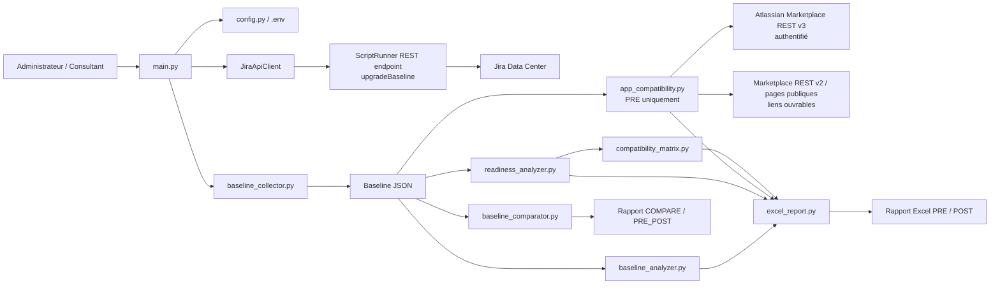
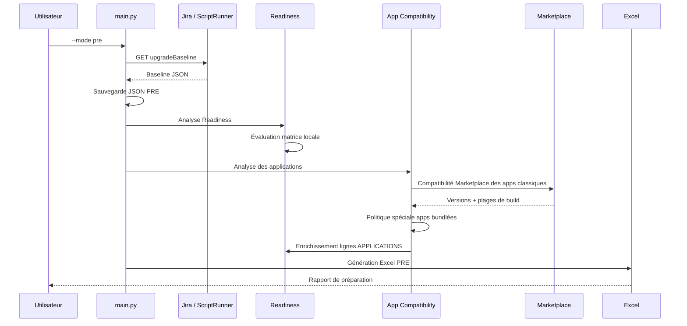

# JiraUpgradeBaselineToolkit — Documentation d’architecture

**Version documentaire : 1.0 — 16 septembre 2026**  
**Périmètre : préparation et contrôle d’une montée de version Jira Data Center**  
**Cas courant du projet : Jira 10.3.25 → Jira 11.3.11**

## 1. Objectif du toolkit

`JiraUpgradeBaselineToolkit` automatise la collecte d’une baseline technique Jira, produit un état de préparation avant upgrade, analyse la compatibilité des applications, puis permet de comparer l’état PRE et POST.

Le toolkit ne remplace pas le runbook d’upgrade. Il fournit les éléments de décision, de traçabilité et de contrôle nécessaires au runbook : inventaire, readiness, compatibilités, preuves et comparaison après upgrade.

Principes structurants :

- la **source réelle** est collectée automatiquement depuis Jira via un endpoint ScriptRunner ;
- la **cible Jira** est définie dans la configuration locale (`.env`) ;
- les contrôles sont séparés entre **AUTO**, **EXTERNAL** et **MANUAL** ;
- les applications tierces sont évaluées dynamiquement via Atlassian Marketplace ;
- les composants Atlassian bundlés avec Jira suivent une politique différente des apps Marketplace classiques ;
- le rapport PRE devient le document de travail de préparation et de décision ;
- la comparaison POST se base sur les baselines JSON, et non sur les cellules modifiées manuellement dans Excel.

---

## 2. Architecture logique



### Séparation des responsabilités

| Composant | Responsabilité principale |
|---|---|
| `main.py` | Orchestration des modes `pre`, `post`, `compare` |
| `config.py` | Chargement et validation de la configuration |
| `api_client.py` | Appels HTTP Jira, retry/backoff, statistiques techniques |
| `baseline_collector.py` | Appel de l’endpoint ScriptRunner et récupération du JSON |
| Endpoint Groovy `upgradeBaseline` | Collecte côté Jira des informations serveur, Jira, DB, JVM et apps |
| `baseline_analyzer.py` | Détection de findings sur l’état collecté |
| `readiness_analyzer.py` | Construction des contrôles de préparation à l’upgrade |
| `compatibility_matrix.py` | Matrice locale des plateformes supportées pour la cible Jira |
| `app_compatibility.py` | Analyse des apps tierces et politique des apps Atlassian bundlées |
| `baseline_comparator.py` | Comparaison des baselines PRE et POST |
| `excel_report.py` | Génération des onglets Excel, styles, liens et statuts |
| `logger.py` | Journalisation |
| `utils/files.py` | Nommage, horodatage, lecture/écriture JSON, sélection du dernier fichier |

---

## 3. Endpoint ScriptRunner

Le toolkit s’appuie sur un endpoint ScriptRunner côté Jira :

```text
GET /rest/scriptrunner/latest/custom/upgradeBaseline
```

L’endpoint est restreint au groupe `jira-administrators`.

Il collecte notamment, selon disponibilité :

- version et build Jira ;
- build applicatif et build enregistré en base ;
- Base URL ;
- architecture single node / cluster ;
- chemins `JIRA_HOME` et installation ;
- version Java, JVM, `JAVA_HOME`, Xms/Xmx et informations mémoire ;
- OS, architecture CPU, nombre de processeurs, mémoire physique ;
- espace disque ;
- informations de connexion DB non sensibles : type, schéma, URL JDBC, driver, utilisateur ;
- inventaire des applications tierces ;
- applications Atlassian importantes suivies ;
- volumétrie de configuration Jira (projets, champs, issue types, statuts, workflows, etc.).

Le mot de passe de base de données ne doit jamais être retourné par l’endpoint.

> Certaines informations peuvent rester absentes si Jira ou l’environnement ne les expose pas. Elles doivent alors apparaître comme `UNKNOWN` ou `NOT_ASSESSED`, et non être devinées.

---

## 4. Flux PRE

Commande :

```powershell
python main.py --mode pre
```

Séquence :



Le mode PRE est le seul mode qui exécute actuellement l’analyse détaillée `App Compatibility`.

### Sorties PRE

```text
output/
├── json/
│   └── <INSTANCE>_PRE_<timestamp>.json
├── excel/
│   └── <INSTANCE>_PRE_<timestamp>.xlsx
└── logs/
```

Le JSON est la photographie technique automatique. L’Excel PRE est la vue exploitable par le projet.

---

## 5. Flux POST

Commande :

```powershell
python main.py --mode post
```

Le mode POST recollecte l’instance après upgrade et produit :

- une baseline JSON POST ;
- les findings de l’état POST ;
- un Readiness recalculé face à la cible ;
- un rapport Excel POST.

L’analyse détaillée Marketplace des applications n’est pas relancée en mode POST. La validation des apps après upgrade doit être faite à travers les tests POST et les contrôles prévus dans le runbook.

---

## 6. Flux COMPARE

Commande :

```powershell
python main.py --mode compare
```

Le programme recherche les fichiers les plus récents correspondant à :

```text
<INSTANCE>_PRE_*.json
<INSTANCE>_POST_*.json
```

Puis il compare les valeurs attendues entre PRE et POST.

Le rapport COMPARE contient l’onglet `PRE_POST` en complément des vues construites à partir de l’état POST.

> Point important : le mode `compare` compare les **JSON techniques**. Les modifications manuelles apportées au fichier Excel PRE ne sont pas reprises automatiquement dans le rapport COMPARE.

---

## 7. Readiness

`readiness_analyzer.py` construit une liste de contrôles répartis par domaines, notamment :

- JIRA / UPGRADE ;
- JAVA ;
- DATABASE ;
- ARCHITECTURE ;
- OS / INFRASTRUCTURE ;
- FILESYSTEM / PROXY ;
- AUTHENTICATION / LDAP ;
- MAIL ;
- AUTOMATION ;
- INTEGRATIONS ;
- SCRIPTING ;
- INDEX / DATA ;
- BACKUP / ROLLBACK ;
- CLONE ;
- TESTING ;
- ACCESS / LOGGING ;
- LICENSING / MONITORING ;
- GOVERNANCE ;
- APPLICATIONS.

### Méthodes d’évaluation

| Méthode | Signification |
|---|---|
| `AUTO` | La valeur et/ou le contrôle est évalué automatiquement par le programme |
| `EXTERNAL` | L’évaluation nécessite une source externe officielle ou un service externe |
| `MANUAL` | Une vérification humaine ou opérationnelle est nécessaire |

### Statuts Readiness

| Statut | Sens |
|---|---|
| `PASS` | Contrôle effectué et conforme |
| `WARNING` | Contrôle effectué ; attention ou action à prévoir, sans être nécessairement bloquante |
| `FAIL` | Prérequis non respecté ou blocage à traiter |
| `NOT_ASSESSED` | Information connue, mais contrôle/validation pas encore réalisé |
| `UNKNOWN` | L’information nécessaire n’a pas pu être obtenue |
| `INFO` | Information descriptive, sans décision de conformité |
| `N/A` | Non applicable au contexte |

`NOT_ASSESSED` ne doit pas être remplacé par `UNKNOWN` : ces deux statuts ont des significations différentes.

---

## 8. Matrice des plateformes supportées

`compatibility_matrix.py` contient la matrice locale utilisée par le toolkit pour évaluer les prérequis de plateforme de la cible, par exemple :

- Java ;
- moteurs et versions de base de données ;
- drivers JDBC lorsque référencés ;
- OS ;
- infrastructure.

La version exacte de Jira est ramenée à sa famille lorsque nécessaire. Exemple :

```text
11.3.11 -> famille 11.3
```

Statuts de la matrice :

- `SUPPORTED` → `PASS` ;
- `TESTED` → `PASS` ;
- `DEPRECATED` → `WARNING` ;
- `UNSUPPORTED` → `FAIL`.

Cette matrice est une donnée de référence **versionnée dans le code**. Elle doit être revue lorsque la cible Jira change ou lorsque la documentation Atlassian évolue.

---

## 9. Compatibilité des applications

### 9.1 Apps Marketplace classiques

Pour les apps non bundlées, `app_compatibility.py` :

1. récupère le build Marketplace correspondant à Jira source ;
2. récupère le build Marketplace correspondant à Jira cible ;
3. récupère toutes les versions Data Center de l’app avec pagination ;
4. compare les plages `minBuildNumber` / `maxBuildNumber` ;
5. identifie :
   - la version actuelle ;
   - la dernière version compatible source ;
   - une éventuelle **Bridge Version** compatible source + cible ;
   - une éventuelle **Target-only Version** compatible uniquement avec la cible ;
6. détermine une stratégie.

La `Latest Source-Compatible Version` est informative : elle ne signifie pas qu’il faut obligatoirement mettre l’app à jour vers cette version avant l’upgrade.

### 9.2 Stratégies possibles

| Strategy | Signification |
|---|---|
| `KEEP` | La version actuelle est compatible source et cible ; elle traverse l’upgrade |
| `PRE_UPGRADE_BRIDGE` | Installer la version pont avant Jira |
| `PRE_UPGRADE_BRIDGE_THEN_POST` | Installer une version pont avant Jira, puis éventuellement une version cible après validation |
| `DISABLE_THEN_POST_UPGRADE` | Pas de pont : désactiver avant Jira, upgrader Jira, installer la version cible, réactiver et tester |
| `MANUAL_REVIEW` | Le moteur ne peut pas conclure automatiquement |
| `NO_TARGET_VERSION` | Aucune version cible supportée n’a été identifiée ; blocage à traiter |
| `BUNDLED_WITH_JIRA` | Le composant est fourni avec Jira cible ; pas de version pont séparée à gérer |

### 9.3 Applications Atlassian bundlées

Les plugin keys actuellement traitées par politique spéciale sont :

| Application | Management Mode | Readiness d’upgrade |
|---|---|---|
| Automation for Jira | `BUNDLED_WITH_JIRA` | `PASS` |
| Authentication / SSO Data Center | `BUNDLED_UPDATABLE` | `PASS` |
| Jira Cloud Migration Assistant | `BUNDLED_UPDATABLE` | `PASS` |

Pour ces composants, `PASS` signifie : **aucune action de compatibilité séparée n’est requise pour faire l’upgrade Jira**.

Cela ne supprime pas les validations POST :

- Automation : vérifier les règles critiques ;
- SSO : tester la connexion, l’authentification de secours et les scénarios prévus ;
- JCMA : vérifier ensuite la version utile à la préparation de la migration Cloud.

---

## 10. Utilisation des API Marketplace

Deux usages sont volontairement séparés :

### API v3 authentifiée

Utilisée pour le calcul de compatibilité :

```text
https://api.atlassian.com/marketplace/rest/3
```

Les identifiants peuvent être fournis via :

```text
MARKETPLACE_EMAIL
MARKETPLACE_API_TOKEN
```

avec fallback dans le code sur :

```text
JIRA_EMAIL
JIRA_API_TOKEN
```

Il est préférable d’utiliser des identifiants Marketplace dédiés lorsque les identifiants Jira Data Center ne sont pas ceux d’un compte Atlassian utilisable avec l’API Marketplace.

### Liens publics

Le calcul reste fait avec l’API authentifiée, mais les liens affichés dans Excel sont construits à partir des ressources Marketplace publiques afin qu’un clic depuis Excel n’ouvre pas une URL REST nécessitant un header d’authentification.

---

## 11. Résilience HTTP

Le projet gère les principaux cas transitoires :

- HTTP `429` avec prise en compte de `Retry-After` ;
- retry/backoff ;
- erreurs serveur `5xx` ;
- erreurs réseau ;
- pagination Marketplace par curseur.

Les statistiques du `JiraApiClient` affichées en fin d’exécution concernent les appels effectués via ce client. Les appels Marketplace utilisent leur propre mécanisme.

---

## 12. Structure du rapport Excel

Selon le mode, le rapport peut contenir :

| Onglet | PRE | POST | COMPARE |
|---|:---:|:---:|:---:|
| `Summary` | Oui | Oui | Oui |
| `Baseline` | Oui | Oui | Oui, état POST |
| `Findings` | Oui | Oui | Oui, état POST |
| `Readiness` | Oui | Oui | Oui, état POST |
| `App Compatibility` | Oui | Non | Non |
| `Supported Platforms` | Oui | Oui | Oui |
| `PRE_POST` | Non | Non | Oui |

---

## 13. Sécurité et secrets

Règles de conception :

- ne jamais écrire les tokens dans les rapports ;
- ne jamais retourner le mot de passe de base de données dans la baseline ;
- conserver `.env` hors Git ;
- ne pas versionner les fichiers de sortie contenant des informations d’environnement sans validation préalable ;
- limiter l’accès au endpoint ScriptRunner aux administrateurs Jira ;
- utiliser des comptes avec le minimum de droits nécessaire.

Pour le futur dépôt Git, `.gitignore` devra au minimum exclure :

```gitignore
.env
__pycache__/
*.pyc
output/
```

---

## 14. Points d’extension

L’architecture permet d’ajouter :

- de nouvelles propriétés à l’endpoint Groovy sans casser les anciens chemins grâce aux fonctions de fallback du Readiness ;
- de nouvelles lignes dans `compatibility_matrix.py` ;
- de nouvelles politiques d’apps bundlées par plugin key ;
- de nouveaux domaines Readiness ;
- de nouveaux comparateurs PRE/POST ;
- des exports complémentaires sans modifier la collecte source.

---

## 15. Limites actuelles

- La matrice `Supported Platforms` est locale au code : elle doit être maintenue et validée pour chaque nouvelle cible.
- Certaines informations techniques restent `UNKNOWN` tant qu’elles ne sont pas exposées par l’endpoint ou confirmées manuellement.
- Le mode POST ne réexécute pas `App Compatibility`.
- Le mode COMPARE ne reprend pas les décisions manuelles saisies dans l’Excel PRE.
- Le toolkit prépare et contrôle l’upgrade ; il n’exécute pas l’upgrade Jira lui-même.

---

## 16. Cycle d’utilisation recommandé

```text
1. Déployer / vérifier l’endpoint ScriptRunner
2. Configurer .env
3. Exécuter PRE
4. Choisir le fichier Excel PRE de référence
5. Compléter le Readiness manuel
6. Traiter FAIL / WARNING / NOT_ASSESSED
7. Réaliser l’upgrade selon le runbook
8. Exécuter POST
9. Exécuter COMPARE
10. Réaliser les tests fonctionnels POST
11. Statuer Go / No-Go / clôture
```

